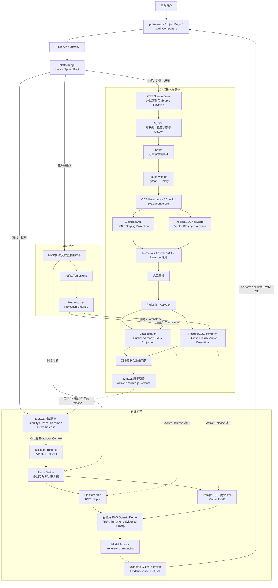

# VerityMesh

VerityMesh 是面向单企业、多项目场景的知识治理与智能问答平台。它将分散的项目资料转换为经过扫描、治理、审批、版本化发布和可回滚的知识资产，再通过企业门户、项目知识页、Web Component、TypeScript Client 和 REST/SSE API，为匿名用户、登录用户及项目授权用户提供范围明确、证据可追踪的检索与问答。

## 当前状态

| 项目项 | 当前状态 |
| --- | --- |
| 技术架构基线 | `docs/tech-plan.md v5.4`，基线日期为 2026-08-11 |
| 第一阶段实施方案 | `ACCEPTED`，已完成范围、分层职责和验收门禁设计 |
| 第一阶段七天路线 | `ACCEPTED`，可以作为开工后的执行依据 |
| 第一阶段开发 | `NOT_STARTED`，开工前十项检查尚未全部核验，七天倒计时尚未开始 |
| 技术选型 | 核心架构方向已冻结；部分托管产品、版本、Region、SKU 和生产门禁仍待关闭 |
| 第一天启动条件 | 人员、仓库、工具、本地与云环境、模型权限、测试资产、测试身份、容量输入和当日决策人全部就绪 |

七天路线的目标是生成一个可部署、可回滚、可验证的**待发布候选版本**，不是自动完成生产上线。第一阶段只有在 50 条验收门禁都拥有当前代码 Revision 的证据后，才能标记为开发完成。

## 项目要解决的问题

- 将项目文档从原始资料转换为经过审核、可追踪、可撤回的对外知识，而不是把未治理文件直接交给模型。
- 为企业门户、项目知识页和宿主系统提供统一的聊天 UI、协议、Citation 和会话体验。
- 以 Project、Release、Locale、Access Segment、Session 和 Memory 为边界，防止跨项目串线、旧版本混用和越权检索。
- 让回答中的事实来自可引用 Evidence，并在输出前完成 Claim Grounding；证据不足时返回 Evidence-only 或拒答。
- 在共享运行时中同时支持固定项目问答和跨项目问答，避免为每个项目重复部署一套 Agent。

## 产品能力

| 能力域 | 第一阶段提供的能力 |
| --- | --- |
| 知识治理 | 上传、批量导入、签名 Push API、扫描、解析/OCR、去重、Chunk、Embedding、审批、发布评测、回滚、撤回和删除传播 |
| 用户入口 | 企业统一门户、标准项目知识页、治理控制台、Vue Web Component、TypeScript Client、REST/OpenAPI 和 SSE |
| 身份与隔离 | 匿名访问、平台统一登录、ProjectGrant、三类 Access Segment、Guest Session、OIDC、Bootstrap Token 和对象级授权 |
| 单项目问答 | 固定 Project 与 Knowledge Release，执行混合检索、Evidence 生成、Citation、Grounding、拒答和反馈 |
| 跨项目问答 | Global Router 只在用户有权访问的项目集合中路由，按项目查询后聚合 Evidence，并保留每条引用的项目归属 |
| 版本与运行 | 不可变 Knowledge Release、Assistant Profile Version 和 Deployment Revision，支持原子激活、回滚和紧急撤回 |

## 平台如何工作

下面的缩略图把用户入口、在线问答、知识发布和紧急撤回串成一张连通图。完整节点、数据流和故障边界见 [`docs/architecture.md`](docs/architecture.md)。



## RAG 编排

固定项目入口直接进入对应 Project Assistant；只有 Global Deployment 才调用 Global Router，并且路由候选只能来自当前用户有权访问的项目集合。检索与回答主链路为：

```text
服务端解析 Scope、Binding、Release 与权限
  -> 构造不可由客户端修改的 Execution Context
  -> Elasticsearch BM25 Top-K || PostgreSQL/pgvector Vector Top-K
  -> 按 chunk_id 执行 Domain RRF
  -> Reranker
  -> Evidence Hub
  -> Prompt Builder / Generator
  -> Claim Grounding / Citation
  -> 仅输出已验证 SSE、Evidence-only 或 Refusal
```

主编排由 `assistant-runtime` 内自研的受约束 RAG Domain Kernel 承担。第一阶段不使用 LangChain、LangGraph 或 MaxKB Runtime 持有 Scope、Release、Revocation、Evidence、Citation 与 Grounding 控制权；模型供应商能力通过可替换的领域端口和 Provider Adapter 接入。

## 技术架构

首期采用四个 Deployment。Java 内部保持模块化单体，在线 AI 与离线批处理因资源、依赖和故障边界不同而分开部署。

| 层次 | 组件与技术 | 主要职责 |
| --- | --- | --- |
| 前端体验层 | `portal-web`、`assistant-ui`；Vue 3 + TypeScript + Vite | 企业门户、项目页、治理界面、统一聊天 UI、Vue Web Component 和 TypeScript Client |
| Java 平台层 | `platform-api`；Java + Spring Boot 模块化单体 | Project、Identity、Grant、Session、Thread、Release、任务状态、审计、Transactional Outbox 和公开 API |
| 在线 AI 层 | `assistant-runtime`；Python + FastAPI + `uv` | Execution Context Guard、Project/Global 查询计划、混合检索、RAG Kernel、模型访问、Grounding、Citation 和已验证事件 |
| 知识批处理层 | `batch-worker`；Python + Celery + `uv` | Kafka 事件分发、扫描、解析/OCR、去重、Chunk、Embedding、批量投影、评测、激活准备和删除传播 |
| 部署与弹性 | 阿里云 ACK + KEDA | 部署四个独立工作负载；按在线并发、Kafka Lag 和 Celery Queue 等待时间分别扩缩容 |
| 模型访问 | 阿里云百炼主平台、火山方舟跨云备供；原生 SDK/REST Adapter | 统一模型注册、路由、配额、审计、超时、降级和 Revision 管理 |

当前模型方向包括 `qwen3.7-text-embedding` Embedding 主候选、`qwen3-rerank` Reranker 主候选，以及百炼 Generator 主模型与方舟跨云回退；这些方向仍需按技术选型表关闭固定 Revision、质量、延迟、容量、成本和合同门禁，不能从“候选已确认”推导为生产已经就绪。

## 数据所有权

| 数据系统 | 保存什么 | 明确不是什么 |
| --- | --- | --- |
| MySQL | Project、Identity 映射、Grant、Access Policy、SourceRevision 元数据、治理与任务状态、Session/Thread、Conversation、Release、Binding、Deployment Revision、Outbox 和业务审计 | 检索投影或大对象仓库；它是 Java 业务与控制状态的唯一权威库 |
| OSS | 原始文件、治理内容、解析/OCR 产物、不可变 Knowledge Revision、Chunk Manifest、评测和发布资产 | 在线业务事务库；它是内容资产事实源 |
| PostgreSQL/pgvector | Chunk、Citation、过滤字段、Embedding Space/Model Revision、内容 Hash 和 Dense Vector | 可独立修改的业务真相；它是 Python 所有、可重建的 Vector Serving Projection |
| Elasticsearch 8.17 | BM25 正文、标题、章节、过滤字段和高亮数据 | Dense Vector 或发布状态真相；它只承担可重建 BM25 Serving Projection |
| Redis Online | 活跃 Session、短期 Memory、限流、授权缓存和撤回清单 | 持久业务状态；与 Celery Redis 隔离 |
| Redis Celery | Celery Broker 与短期 Result 协调 | 业务状态机、发布真相或长期任务记录 |
| Kafka | Transactional Outbox、知识接入、治理、发布、授权、删除和 Worker 进度等可重放领域事件 | MySQL 业务真相或 Celery 任务私有协议 |

两套检索投影按 `knowledge_release_id` 不可变构建。只有 Elasticsearch BM25 与 PostgreSQL/pgvector Vector Projection 都准备完成并通过评测后，Java 才能在 MySQL 单事务中切换 Active Release；这次 MySQL 提交是唯一发布提交点。

MySQL Schema 由 Java 仓库内的 Flyway 管理，PostgreSQL/pgvector Schema 由 Python `uv` Workspace 内的 Alembic 管理。两者通过独立预部署 Migration Job 执行，应用运行身份没有 DDL 权限。当前没有生产存量数据，因此只建立版本化 Schema Migration，不虚构 PostgreSQL 到 MySQL 的数据搬迁脚本。

## 安全与正确性边界

1. 在线助手只允许检索 Published Knowledge Zone。
2. Project、Release、Locale 和权限范围由服务端计算；浏览器与模型都不能扩大范围。
3. Memory 只维持对话连续性，事实必须来自当前 Release 中可引用的 Evidence。
4. 权限、撤回、Release、Evidence 或 Grounding 状态不明时 fail closed。
5. 原始模型 Token 不直接流向用户；只有完成 Claim Grounding 的内容才能进入 SSE。
6. 紧急撤回先通过 MySQL 与 Redis Online 同步阻断，再由 Kafka 驱动两套检索投影最终收敛。

## 三阶段路线

| 阶段 | 需要搭建的功能 |
| --- | --- |
| 第一阶段：知识与问答平台 | 知识导入、治理、审批、发布、回滚和撤回；门户、项目页、统一聊天 UI、Web Component、TypeScript Client、身份与 Session；单项目混合 RAG、Citation、Grounding、Global Router 和跨项目问答 |
| 第二阶段：登录用户业务工具 | 项目业务 API Connector、受限 ToolPlan 与 Tool Executor，为登录用户提供经过对象授权、确认、幂等和审计的实时查询与低风险操作 |
| 第三阶段：GraphRAG | 项目范围知识图谱、Local 多跳检索、异步主题归纳，以及跨项目分别查询后聚合的图检索能力 |

## 第一阶段七天路线

七天计划在开工前检查全部通过后执行，要求前端、Java 后端、在线 AI、知识批处理、基础设施和测试并行推进，不是单人顺序开发工期。

| 天数 | 当天主目标 | 当天结束后必须能看到的结果 |
| --- | --- | --- |
| Day 1 | 建立工程、接口、迁移基线和知识接入入口 | 上传文件后保存源对象、登记修订记录并可靠发出处理事件 |
| Day 2 | 打通知识治理和索引构建 | 文件经过扫描、解析、Chunk、Embedding 和评测后成为可审核候选 |
| Day 3 | 完成阶段 1A | 管理员可发布、回滚和撤回；匿名用户可在固定项目中问答并查看引用 |
| Day 4 | 完成阶段 1B | 用户可登录和保存会话；宿主项目可通过 Web Component 与 TypeScript Client 接入 |
| Day 5 | 完成阶段 1C | 门户可在授权项目中路由、切换项目并生成带项目来源的跨项目回答 |
| Day 6 | 停止新增功能，完成生产前加固 | 越权、并发、性能、主要故障和恢复场景通过预验收 |
| Day 7 | 全量验收 | 从干净环境构建并验证全部功能，生成唯一待发布候选版本和 50 条门禁证据包 |

详细分层职责、交付批次和门禁见 [`第一阶段实施执行方案`](docs/implementation-designs/0001-phase-1-execution-plan.md)，逐日任务、演示结果和结束检查见 [`第一阶段七天执行路线`](docs/implementation-designs/0002-phase-1-seven-day-execution-route.md)。

## 尚待关闭的关键事项

- 生产 Region、可用区、实例规格、容量和成本预算尚未完全冻结。
- MySQL 与 PostgreSQL/pgvector 的具体托管产品仍需同条件 PoC；Elasticsearch 8.17 的生产资格仍受真实语料、权限、容量、成本和退出门禁约束。
- Public API Gateway、IdP/CIAM、Policy Engine、KMS/Secret、边缘与数据安全、文档 Parser/OCR，以及可观测性后端等产品仍待选型或验证。
- Router、Planner、OCR、安全检测和部分 Grounding 模型尚未完成生产选型。
- 仓库中的既有文本检索 PoC 仍包含历史 Elasticsearch Vector Adapter，只证明旧 Harness 可复现；目标栈 `Elasticsearch BM25 + PostgreSQL/pgvector Vector` 的联合 PoC 仍需形成当前证据。

完整外部依赖状态以 [`docs/technology-selection/technology-selection.md`](docs/technology-selection/technology-selection.md) 为准。`SELECTED`、`CONFIRMED_WITH_GATES` 和 `PRIMARY_POC` 含义不同，不能混写成“技术栈已全部确定”。

## 仓库结构

```text
VerityMesh/
|-- apps/
|   `-- portal-web/              # Vue 3 门户与项目知识页 Deployment
|-- services/
|   |-- platform-api/            # Java/Spring Boot 模块化单体
|   |-- assistant-runtime/       # Python/FastAPI 在线 AI Runtime
|   `-- batch-worker/            # Python/Celery 知识批处理 Worker
|-- packages/
|   |-- assistant-ui/            # Vue UI 与 Web Component
|   `-- typescript-client/       # OpenAPI/SSE TypeScript Client
|-- contracts/                   # 跨语言 OpenAPI、事件、任务与错误合同
|-- infra/                       # 本地环境、ACK 资源与独立 Migration Job
|-- tests/                       # 跨服务合同、E2E、评测、安全与性能测试
|-- docs/                        # 架构、ADR、技术选型、实施方案、PoC 与 Runbook
`-- tools/                       # 仓库验证、代码生成与可重复 PoC 工具
```

目录骨架只冻结组件所有权，不表示应用已经初始化完成。前端包管理器、Node、Java 构建工具、JDK 和 Schema 生成方式通过开工前检查后，才在对应目录创建正式工程清单与锁文件。目录边界说明见 [`docs/README.md`](docs/README.md)。

## 文档导航

| 需要了解的内容 | 唯一入口 |
| --- | --- |
| 文档目录与事实源边界 | [`docs/README.md`](docs/README.md) |
| 项目目标、领域边界、安全不变量与系统约束 | [`docs/tech-plan.md`](docs/tech-plan.md) |
| 端到端用户交互和开发架构图 | [`docs/architecture.md`](docs/architecture.md) |
| 外部依赖选择、状态与下一决策 | [`docs/technology-selection/technology-selection.md`](docs/technology-selection/technology-selection.md) |
| 改变架构边界的重大决策与权衡 | [`docs/adr/`](docs/adr/) |
| 组件设计、接口、状态机、实施方案与执行路线 | [`docs/implementation-designs/`](docs/implementation-designs/) |
| PoC 证据、测试结果与限制 | [`docs/poc-reports/`](docs/poc-reports/) |
| 部署、升级、恢复与排障步骤 | [`docs/runbooks/`](docs/runbooks/) |

## 仓库验证

提交前运行：

```sh
./tools/verify-repository.sh
```

该命令检查 Monorepo 目录边界、Markdown 本地链接、`docs/architecture.md` 的有向连通性，并运行文本检索 PoC 的单元测试和本地合同验证。云端 PoC 需要显式配置和批准，不属于默认仓库验证。

协作与提交规则见 [`CONTRIBUTING.md`](CONTRIBUTING.md)。
