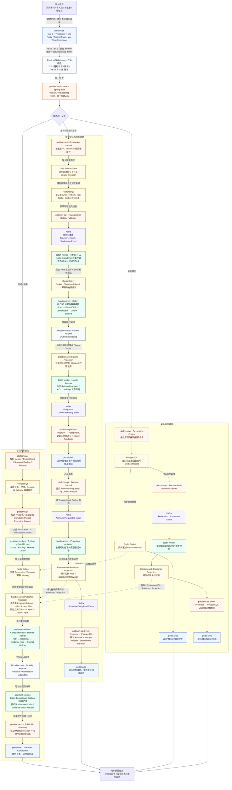

# VerityMesh 开发架构图

```mermaid
flowchart TB
    user["平台用户<br/>消费者 / 内容人员 / 审批者 / 管理员"]
    uiEntry["portal-web<br/>Vue 3 + TypeScript + Vite<br/>Portal / Project Page / Vue Web Component"]
    publicGateway["Public API Gateway · 产品待选<br/>TLS / 基础认证 / 限流 / REST 与 SSE 转发"]
    apiEntry["platform-api · Java + Spring Boot<br/>Public API / Bootstrap Token / 统一审计入口"]
    interaction{"本次用户交互"}
    userResult["用户获得结果<br/>已验证回答 / 发布状态 / 撤回状态"]

    user -->|"打开门户、项目页或宿主组件"| uiEntry
    uiEntry -->|"REST / SSE；外部 Embed 使用一次性 Bootstrap Token"| publicGateway
    publicGateway -->|"统一转发"| apiEntry
    apiEntry --> interaction

    subgraph online["在线问答链路"]
        direction TB
        qAccess["platform-api<br/>解析 Identity / ProjectGrant / Session / Binding / Release"]
        qAuthority["PostgreSQL<br/>读取业务、权限、Session 与 Release 权威状态"]
        qContext["platform-api<br/>构造不可由客户端指定的 Immutable Project Execution Context"]
        qGuard["assistant-runtime · Python + FastAPI + uv<br/>Scope / Binding / Release Guard"]
        qRevocation["Redis Online<br/>复核 Revocation / Session / 短期 Memory"]
        qSearch["Elasticsearch Published Projection<br/>先应用 Project / Release / Locale / Access Filter<br/>再独立执行 BM25 Top-K + Vector Top-K"]
        qKernel["assistant-runtime · Constrained RAG Domain Kernel<br/>RRF → Reranker → Evidence Hub → Prompt Builder"]
        qModels["Model Access / Provider Adapter<br/>Reranker / Generator / Grounding"]
        qValidation["assistant-runtime<br/>Claim Grounding / Citation / 内容门禁<br/>只产生 Validated Claim / Evidence-only / Refusal"]
        qProxy["platform-api → Public API Gateway<br/>记录 Message / Audit 并代理 Validated SSE"]
        qView["portal-web / Vue Web Component<br/>展示答案、引用或拒答"]

        qAccess --> qAuthority
        qAuthority --> qContext
        qContext -->|"内部 mTLS REST + Immutable Context"| qGuard
        qGuard -->|"每个请求都检查"| qRevocation
        qRevocation -->|"未命中撤回才允许召回"| qSearch
        qSearch -->|"受约束候选集"| qKernel
        qKernel -->|"领域端口调用"| qModels
        qModels -->|"可校验模型结果"| qValidation
        qValidation -->|"禁止透传原始 Token"| qProxy
        qProxy --> qView
    end

    interaction -->|"提问 / 搜索"| qAccess
    qView --> userResult

    subgraph publishing["知识接入与发布链路"]
        direction TB
        kControl["platform-api · Knowledge Control<br/>接收上传、Push API 或治理操作"]
        kSource["OSS Source Zone<br/>保存源对象与不可变 Source Revision"]
        kSourceTx["PostgreSQL<br/>提交 SourceRevision / Task State / Outbox Record"]
        kOutbox["platform-api · Transactional Outbox Publisher"]
        kSourceEvent["Kafka<br/>发布可重放 SourceRevision / Tombstone Event"]
        kDispatcher["batch-worker · Python + uv<br/>Kafka Dispatcher 将事件转换为 Celery JSON Task"]
        kCelery["Redis Celery<br/>Broker / Short-lived Result / 幂等与有限重试"]
        kBuild["batch-worker · Celery<br/>从 OSS 读取内容并编排 Scan → Parse/OCR → Deduplicate → Chunk → Embed"]
        kBatchModels["Model Access / Provider Adapter<br/>OCR / Embedding"]
        kStaging["Elasticsearch Staging Projection<br/>批量写入待发布 Chunk 与权限投影"]
        kEvaluation["batch-worker + Model Access<br/>执行 Retrieval / Answer / ACL / Leakage 发布评测"]
        kReadyEvent["Kafka<br/>Progress / CandidateReady Event"]
        kCandidate["platform-api Event Projector → PostgreSQL<br/>更新任务状态与 Release Candidate"]
        kApproval["portal-web<br/>内容审批者查看评测结果并批准激活"]
        kRelease["platform-api · Release Control<br/>提交 ActivationRequested 与 Outbox Record"]
        kActivationEvent["Kafka<br/>ActivationRequested Event"]
        kActivator["batch-worker · Projection Activator<br/>执行经过批准的索引激活命令"]
        kPublished["Elasticsearch Published Projection<br/>原子切换 Alias / Deployment Revision"]
        kCompletedEvent["Kafka<br/>ActivationCompleted Event"]
        kActiveState["platform-api Event Projector → PostgreSQL<br/>确认 Active Knowledge Release / Deployment Revision"]
        kView["portal-web<br/>展示发布成功、失败或可回滚状态"]

        kControl -->|"写入隔离源区"| kSource
        kSource -->|"源对象落盘后登记元数据"| kSourceTx
        kSourceTx -->|"只读取已提交记录"| kOutbox
        kOutbox --> kSourceEvent
        kSourceEvent --> kDispatcher
        kDispatcher -->|"禁止 Java 直接写 Celery 私有消息"| kCelery
        kCelery --> kBuild
        kBuild -->|"领域端口调用"| kBatchModels
        kBatchModels -->|"结构化解析结果与 Chunk Vector"| kStaging
        kStaging --> kEvaluation
        kEvaluation -->|"全部发布门禁通过"| kReadyEvent
        kReadyEvent --> kCandidate
        kCandidate --> kApproval
        kApproval -->|"人工批准"| kRelease
        kRelease -->|"经 Transactional Outbox 发布"| kActivationEvent
        kActivationEvent --> kActivator
        kActivator -->|"只有批准后才能切换"| kPublished
        kPublished --> kCompletedEvent
        kCompletedEvent --> kActiveState
        kActiveState --> kView
    end

    interaction -->|"上传 / 治理 / 发布"| kControl
    kView --> userResult

    subgraph revoking["紧急撤回链路"]
        direction TB
        rCommand["platform-api · Revocation Control<br/>接收管理员紧急撤回命令"]
        rAuthority["PostgreSQL<br/>提交权威撤回状态与 Outbox Record"]
        rRedis["Redis Online<br/>同步更新 Revocation List"]
        rImmediate["portal-web<br/>返回“撤回已立即生效”"]
        rOutbox["platform-api · Transactional Outbox Publisher"]
        rEvent["Kafka<br/>Revocation / Tombstone Event"]
        rWorker["batch-worker<br/>清理或标记受影响的检索投影"]
        rProjection["Elasticsearch Published Projection<br/>撤回内容最终收敛"]
        rProjected["platform-api Event Projector → PostgreSQL<br/>记录投影清理结果"]
        rView["portal-web<br/>展示撤回投影已完成"]

        rCommand --> rAuthority
        rAuthority -->|"同步安全路径"| rRedis
        rRedis --> rImmediate
        rAuthority -->|"持久异步路径"| rOutbox
        rOutbox --> rEvent
        rEvent --> rWorker
        rWorker --> rProjection
        rProjection --> rProjected
        rProjected --> rView
    end

    interaction -->|"紧急撤回"| rCommand
    rImmediate --> userResult
    rView --> userResult

    rRedis -.->|"更新同一在线撤回清单"| qRevocation
    kPublished -.->|"成为在线问答的新 Published Projection"| qSearch
    rProjection -.->|"删除 / Tombstone 同一 Published Projection"| qSearch

    classDef frontend fill:#eff6ff,stroke:#1d4ed8,color:#172554;
    classDef java fill:#fff7ed,stroke:#c2410c,color:#431407;
    classDef python fill:#ecfdf5,stroke:#047857,color:#052e16;
    classDef data fill:#fefce8,stroke:#a16207,color:#422006;
    classDef event fill:#f5f3ff,stroke:#6d28d9,color:#2e1065;
    classDef external fill:#f8fafc,stroke:#475569,color:#0f172a;

    class uiEntry,qView,kApproval,kView,rImmediate,rView frontend;
    class apiEntry,qAccess,qContext,qProxy,kControl,kOutbox,kCandidate,kRelease,kActiveState,rCommand,rOutbox,rProjected java;
    class qGuard,qKernel,qValidation,kDispatcher,kBuild,kEvaluation,kActivator,rWorker python;
    class qAuthority,qRevocation,qSearch,kSource,kSourceTx,kCelery,kStaging,kPublished,rAuthority,rRedis,rProjection data;
    class kSourceEvent,kReadyEvent,kActivationEvent,kCompletedEvent,rEvent event;
    class publicGateway,qModels,kBatchModels external;
```
